# 📊 Global Superstore Sales Dashboard

An interactive **Sales & Profitability Dashboard** developed using **Microsoft Power BI** to analyze sales performance, profitability, customer and product performance, trends, and geographic distribution using Global Superstore transactional data.

# 🖼️ Dashboard Preview
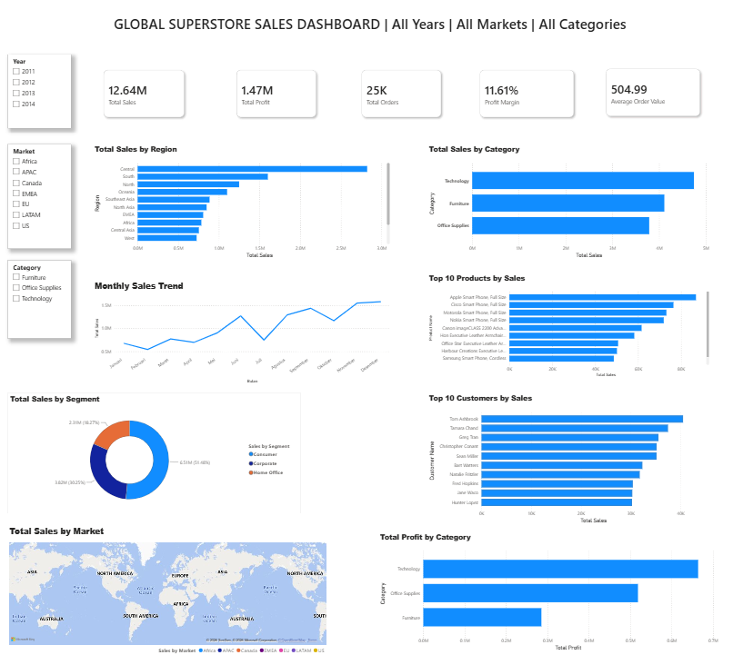

---

## 🎯 Problem Statement

Global Superstore contains transactional data across multiple regions, markets, categories, segments, products, and customers. However, analyzing raw transactional data makes it difficult to quickly identify business performance, sales trends, profitability, and key contributors.

This project addresses the need for an interactive dashboard that enables users to:

- Monitor overall sales and profitability.
- Analyze sales performance across regions, markets, categories, and segments.
- Identify top-performing products and customers.
- Analyze monthly sales trends.
- Evaluate profitability using Total Profit and Profit Margin.
- Explore business performance dynamically using interactive filters.

---

## 🎯 Project Objective

The objective of this project is to transform transactional sales data into an interactive Business Intelligence dashboard that supports:

- Sales performance monitoring
- Profitability analysis
- Trend analysis
- Customer and product analysis
- Geographic analysis
- Interactive business exploration

---

# 🛠️ Tools & Technologies

- **Microsoft Power BI**
- **Power Query**
- **DAX**
- **Data Modeling**
- **Data Visualization**
- **Data Analysis**

---

# 🔄 Project Workflow

The dashboard was developed through the following workflow:

**Import Dataset → Power Query → Data Preparation → Close & Apply → Data Modeling → DAX Measures → KPI Development → Data Visualization → Interactive Slicers → Dynamic Title → Dashboard Formatting → Final Dashboard**

### 1. Import Dataset

Imported the **Global Superstore** transactional dataset into Microsoft Power BI.

### 2. Power Query & Data Preparation

Reviewed and prepared the dataset using **Power Query** to ensure the required fields were available for analysis.

### 3. Close & Apply

Applied the data preparation using **Close & Apply** and loaded the prepared data into the Power BI data model.

### 4. Data Modeling

Prepared the `Fact_Sales` table and created the **Year** column from `Order Date` to support time-based analysis.

### 5. DAX Measures

Created the following analytical measures:

- Total Sales
- Total Profit
- Total Orders
- Average Order Value
- Profit Margin

### 6. KPI Development

Created KPI Cards to provide a high-level overview of business performance.

### 7. Data Visualization

Developed visualizations covering:

- Sales by Region
- Sales by Category
- Monthly Sales Trend
- Sales by Segment
- Top 10 Products by Sales
- Top 10 Customers by Sales
- Sales by Market
- Total Profit by Category

### 8. Interactive Slicers

Added interactive slicers for:

- Year
- Market
- Category

The selected filters dynamically update the dashboard.

### 9. Dynamic Dashboard Title

Created a dynamic title based on the selected filter context.

Example:

**GLOBAL SUPERSTORE SALES DASHBOARD | 2013 | US | All Categories**

### 10. Dashboard Formatting

Performed final formatting and layout adjustments, including:

- KPI alignment
- Card formatting
- Slicer positioning
- Visual sizing
- Spacing
- Alignment
- Consistent visual naming
- Dashboard hierarchy

---

# 📈 Dashboard Visualizations

## 1. KPI Overview

The dashboard contains five key performance indicators:

- **Total Sales**
- **Total Profit**
- **Total Orders**
- **Average Order Value**
- **Profit Margin**

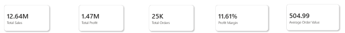

---

## 2. Total Sales by Region

Compares sales performance across different regions.

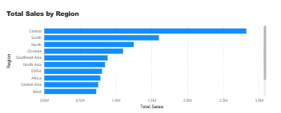

---

## 3. Total Sales by Category

Analyzes sales performance across:

- Technology
- Furniture
- Office Supplies

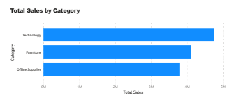

---

## 4. Monthly Sales Trend

Visualizes monthly sales performance and changes over time.

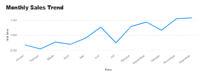

---

## 5. Total Sales by Segment

Analyzes sales contribution from:

- Consumer
- Corporate
- Home Office

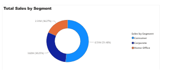

---

## 6. Top 10 Products by Sales

Identifies the top-performing products based on sales.

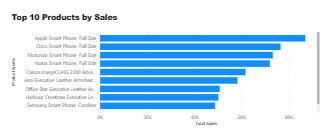

---

## 7. Top 10 Customers by Sales

Identifies customers with the highest sales contribution.

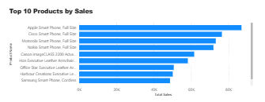

---

## 8. Total Sales by Market

Provides a geographic view of sales performance across markets using a filled map.

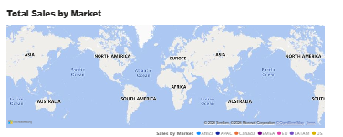

---

## 9. Total Profit by Category

Compares profitability across product categories.

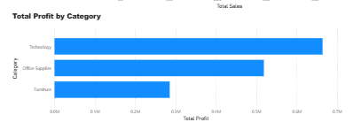

---

# 🎛️ Interactive Features

## Slicers

The dashboard includes three interactive slicers:

**Year | Market | Category**

These filters dynamically update the KPI cards and visualizations.

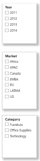

## Dynamic Dashboard Title

The dashboard title automatically reflects the selected filter context.

Example:

> GLOBAL SUPERSTORE SALES DASHBOARD | 2013 | US | All Categories

---

## 🔍 Key Insights

1. APAC generated the highest sales at $3.59M.
2. Technology was the top-selling category with $4.74M in sales.
3. Consumer segment generated the highest sales at $6.51M (51.48%).
4. December recorded the highest monthly sales at approximately $1.58M.
5. Overall profit margin was 11.61%, with $1.47M in total profit.
6. Total sales reached $12.64M from approximately 25K orders.

---

# 📌 Analytical Framework

| Analytical Area | Key Analysis |
|---|---|
| **Sales Performance** | Region, Category, Segment, Market |
| **Trend Analysis** | Monthly Sales Trend |
| **Product Analysis** | Top 10 Products by Sales |
| **Customer Analysis** | Top 10 Customers by Sales |
| **Profitability Analysis** | Total Profit, Profit Margin, Profit by Category |
| **Geographic Analysis** | Sales by Market |

---

# 💼 Business Value

The dashboard provides a centralized view of sales and profitability performance, enabling users to move from high-level KPI monitoring to detailed analysis of:

**Sales → Trends → Regions → Markets → Categories → Segments → Products → Customers → Profitability**

This supports faster exploration of business performance and helps stakeholders identify areas requiring further analysis.

---

# 📁 Project Structure

```text
global-superstore-sales-dashboard/
│
├── README.md
│
├── Global Superstore.xls
│
└── Images/
    ├── dashboard-preview.png
    ├── kpi-overview.png
    ├── sales-by-region.png
    ├── sales-by-category.png
    ├── monthly-sales-trend.png
    ├── sales-by-segment.png
    ├── top-10-products.png
    ├── top-10-customers.png
    ├── sales-by-market.png
    ├── profit-by-category.png
    └── interactive-slicers.png
